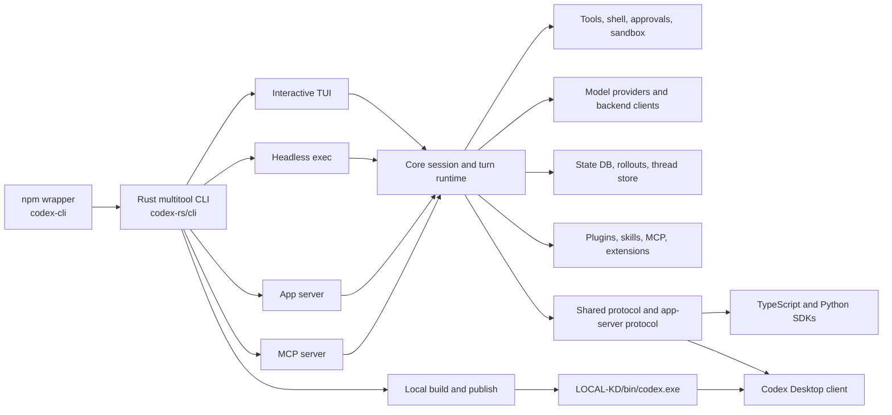

# KD4 Repository Source Map

KD4 is the user's local fork of
[`openai/codex`](https://github.com/openai/codex), with its home repository at
[`ikhdark/KD4`](https://github.com/ikhdark/KD4). This file maps repository
ownership, runtime entrypoints, package boundaries, contracts, generated
artifacts, validation routes, and the local install path.

Read the root [`AGENTS.md`](AGENTS.md) before changing files. This map is the
cross-cutting source of truth when ownership is unclear,
a behavior crosses packages or languages, or a source change must be traced to
an SDK, schema, package, installed binary, or Codex Desktop.

- Product documentation: [OpenAI Codex documentation](https://developers.openai.com/codex)
- Local build and publish policy: [`AGENTS.md`](AGENTS.md)
- Standalone installation guidance: [`scripts/install/README.md`](scripts/install/README.md)
- License: [`LICENSE`](LICENSE)

<!-- Begin ToC -->

- [Maintenance contract](#maintenance-contract)
- [How to use this map](#how-to-use-this-map)
- [Runtime architecture](#runtime-architecture)
- [Top-level ownership](#toplevel-ownership)
- [Instruction scopes](#instruction-scopes)
- [Runtime and executable entrypoints](#runtime-and-executable-entrypoints)
- [Rust package inventory](#rust-package-inventory)
- [Rust edit and upstream synchronization boundaries](#rust-edit-and-upstream-synchronization-boundaries)
  - [Protected source: exact upstream mirrors](#protected-source-exact-upstream-mirrors)
  - [Mixed areas: editable parents and workflow-managed children](#mixed-areas-editable-parents-and-workflowmanaged-children)
  - [Workflow-managed remainder](#workflowmanaged-remainder)
- [Non-Rust project inventory](#nonrust-project-inventory)
- [Core runtime routing](#core-runtime-routing)
- [Extension boundary](#extension-boundary)
- [Persistence and stored state](#persistence-and-stored-state)
- [Contracts and generated artifacts](#contracts-and-generated-artifacts)
- [Build, package, publish, and install paths](#build-package-publish-and-install-paths)
- [Validation routes](#validation-routes)
- [Rust workflow reference](#rust-workflow-reference)
- [Documentation and policy](#documentation-and-policy)
- [Cross-cutting change routes](#crosscutting-change-routes)
  - [Managed KD4 source-owner index](#managed-kd4-sourceowner-index)

<!-- End ToC -->

## Maintenance contract

`SOURCEMAP.md` is a required repository contract, not an optional overview.
Update it in the same change whenever the repository materially changes.

<!-- BEGIN TRACKED PATH SNAPSHOT -->
Tracked repository path snapshot: `count=4904 sha256=bb4e7896f4a3685bbc642e4472dc8f961f667900bb817f15a9e2275d0ad8cd03`.
<!-- END TRACKED PATH SNAPSHOT -->

Every repository file or directory add, delete, move, or rename also requires
running `just source-map-check`. That workflow automatically rewrites the
managed tracked-path snapshot below, even when no ownership description needs a
manual edit. Content-only changes do not alter the snapshot.

A change is material to this map when it does any of the following:

- adds, removes, renames, or repurposes a tracked top-level entry;
- adds, removes, or moves a Rust package or JavaScript/Python project manifest;
- changes a primary executable, SDK, daemon, generator, or runtime entrypoint;
- moves responsibility between crates, packages, scripts, or instruction scopes;
- changes ownership of a public protocol, configuration, stored-state,
  serialization, generated-artifact, or migration contract;
- changes the build, test, package, publish, install, or Desktop runtime-proof
  chain; or
- makes an ownership table or cross-cutting route incomplete or misleading.

An internal implementation change that remains inside an accurately mapped
owner and leaves all routes and contracts unchanged is not material to this
file.

The top-level, instruction, Rust package, and non-Rust project tables below are
machine-checked against tracked repository files. `just source-map-check` first
rewrites the path snapshot, then validates those inventories, ASCII content, and
this table of contents. The check intentionally fails when structural drift
requires a map decision. Do not silence drift by adding a path alone: update the
applicable ownership, entrypoint, contract, and validation descriptions so the
map remains useful.

## How to use this map

1. Read the root `AGENTS.md`.
2. For a clear local task, reuse known owner paths, current evidence, and the
   closest owner instructions. When ownership or a relevant relationship is
   unresolved, query the smallest owner slice before reading the broad map.
   For a known file, use
   `python scripts/source_owners.py slice --path <file> --focus "<task>"`.
   For a known owner, use
   `python scripts/source_owners.py slice --owner <owner-id> --focus "<task description>" --max-relationships 32`.
3. Resolve material unknowns. Expand truncated or omitted relationships when
   they could affect the requested change; unrelated omissions do not require
   broader discovery. Establish the applicable control/data flow, callers/consumers,
   configuration/gates, registration/entrypoints, tests/contracts, generated
   artifacts, and invariants. A facet may be explicitly `not_applicable` with a
   reason; an absent applicable facet is insufficient evidence.
4. Read the exact evidence locations for the relationships you will change.
   Relationships are ranked within each facet by structural role, task-focus
   overlap, provenance, and directness; start with the first relationship in
   each applicable facet before expanding.
   Treat `exact` and `declared` provenance as grounded; heuristic evidence may
   guide discovery but cannot close it.
5. Stop broad discovery once these task-relevant relationships are established.
   Reuse ownership evidence until changes affect its source locations,
   dependencies, registrations, contracts, or instruction scope. Refresh it when
   implementation contradicts the evidence or a concurrent change cannot be
   shown to be independent.
6. Use this broad map only when no owner matches, the slice leaves a material unknown,
   or a new cross-cutting boundary must be placed. Return to the applicable
   policy file for its exact validation and completion gate.

`architecture_index.json` is the machine-readable, manifest-keyed relationship
graph generated from `source_owners.toml`. `just source-owners-check` rejects a
stale graph or managed map block and runs representative architectural recall
cases. Its evaluator reports insufficient evidence separately from bounded but
potentially noisy evidence, plus ranked-noise reduction, reading-volume, and
late-relationship metrics.

`source_owners.py list` includes declared roots. Path queries preserve matched
owners and report uncovered paths in `unowned_paths`, with scoped `rg --files`
commands in `fallback_searches`; they do not infer ownership or validation
routes. Query and slice output reports `index_status` as `reused` or `fallback`.
Reuse still revalidates the selected source evidence. A missing, stale, or invalid
index falls back to the manifest; `just source-owners-generate` refreshes it.

`just gate-for <repository-relative-path>` prints the most specific matching
owners' declared validation commands, including each command's working directory
and argument list. It does not execute them or infer test coverage. Unowned paths
and owners without validation routes produce a partial result and a nonzero exit
status. To resolve several paths together, use
`python scripts/source_owners.py validation --path <file> --path <file>`.

The source-owner manifest is the authority for declared ownership and validation
routes. Repo Atlas can resolve remaining symbol, caller, or impact questions
within that boundary; its results do not replace declared contracts. When the
relevant paths and relationships are already known, read their source directly.

Workspace-evidence recovery is owned by `codex-rs/core/src/tool_history.rs` and
`codex-rs/core/src/tools/command_execution.rs`. A response with
`stale_workspace_evidence: true` and `valid_for_current_workspace: false` cannot
support a current-workspace claim. Rerun the original bounded read with
`force_fresh: true`; normal execution permissions still apply. If a fresh read is
unavailable, report the claim as unverified. Missing observations or output
mismatches alone do not establish that repository contents changed. The owning
`tool_history::tests` exercise these response fields and recovery reasons.

## Runtime architecture

The native Windows Desktop shell is not in this repository. Desktop-visible
completion requires the local binary publish and Desktop restart chain described
below.

## Top-level ownership

| Path                                                             | Owns                                                                                                                                                                                                                                                                  |
| ---------------------------------------------------------------- | --------------------------------------------------------------------------------------------------------------------------------------------------------------------------------------------------------------------------------------------------------------------- |
| `.codex/`                                                        | Repo-local Codex configuration, environment setup, fork-local skills, and workspace policy                                                                                                                                                  |
| `.vscode/`                                                       | Checked-in editor and workspace defaults                                                                                                                                                                                                                              |
| `architecture_index.json`                                        | Generated, manifest-keyed source-owner relationship graph consumed by task-scoped architecture discovery                                                                                                                                                              |
| `codex-cli/`                                                     | npm-facing `@openai/codex` wrapper, native binary discovery, and npm package inputs                                                                                                                                                                                   |
| `codex-rs/`                                                      | Primary Rust workspace and nearly all CLI, runtime, app-server, TUI, tool, protocol, state, plugin, extension, and sandbox behavior                                                                                                                                   |
| `docs/`                                                          | Checked-in documentation contracts and schemas, including investigation-evidence interchange                                                                                                                                                                          |
| `scripts/`                                                       | Build lanes, local publish, package assembly, installers, generated-schema freshness, source-owner generation, workflow preflight, architecture/investigation evaluation, KD4 audit and measurement, runtime binary proof, repository checks, and maintenance tooling |
| `sdk/`                                                           | TypeScript SDK, Python SDK, and Python runtime package                                                                                                                                                                                                                |
| `third_party/`                                                   | Checked-in integration or vendored inputs updated only through their owning workflow                                                                                                                                                                                  |
| `tools/`                                                         | Repository tooling outside the main Rust workspace                                                                                                                                                                                                                    |
| `.codespellignore`, `.codespellrc`                               | Spelling-check configuration and accepted vocabulary                                                                                                                                                                                                                  |
| `.gitattributes`, `.gitignore`                                   | Git content and ignore behavior                                                                                                                                                                                                                                       |
| `.markdownlint-cli2.yaml`, `.prettierignore`, `.prettierrc.toml` | Markdown and Prettier formatting policy                                                                                                                                                                                                                               |
| `.npmrc`                                                         | npm and pnpm behavior used by the JavaScript workspace                                                                                                                                                                                                                |
| `AGENTS.md`, `SOURCEMAP.md`                                      | Repository-wide editing policy and this cross-cutting ownership contract, including the complete `codex-rs` edit and upstream-sync classification                                                                                                                     |
| `LICENSE`, `NOTICE`                                              | Legal notices                                                                                                                                                                                                                                                         |
| `justfile`, `kd4_features.toml`, `source_owners.toml`            | Preferred command router, KD4 feature inventory, and machine-readable source ownership routing                                                                                                                                                                        |
| `package.json`, `pnpm-lock.yaml`, `pnpm-workspace.yaml`          | Root maintenance commands, JavaScript dependency state, and workspace membership                                                                                                                                                                                      |

## Instruction scopes

| Path        | Applies to                                                          |
| ----------- | ------------------------------------------------------------------- |
| `AGENTS.md` | Entire repository; canonical shared policy plus KD4 project context |

## Runtime and executable entrypoints

| Surface                   | Primary entrypoint                                                                                                | Follow-on owners                                                                                 |
| ------------------------- | ----------------------------------------------------------------------------------------------------------------- | ------------------------------------------------------------------------------------------------ |
| npm `codex` launcher      | `codex-cli/bin/codex.js`                                                                                          | `codex-cli/package.json`, staged native packages, platform binary discovery                      |
| Rust multitool CLI        | `codex-rs/cli/src/main.rs`                                                                                        | CLI dispatch, login/auth, plugin/marketplace commands, TUI, exec, app-server, MCP, sandbox setup |
| CLI library support       | `codex-rs/cli/src/lib.rs`                                                                                         | `codex-rs/utils/build-info`, exit-status helpers                                                 |
| Interactive TUI           | `codex-rs/tui/src/main.rs`                                                                                        | `codex-rs/tui/src/lib.rs`, app/session routing, chat widget, bottom pane, core/protocol          |
| Headless execution        | `codex-rs/exec/src/main.rs`                                                                                       | `codex-rs/exec`, core, protocol, JSONL/event output                                              |
| App server                | `codex-rs/app-server/src/main.rs`                                                                                 | app-server library, protocol, transport, core                                                    |
| App-server exec transport | `codex-rs/app-server/src/bin/exec_server.rs`                                                                      | app-server transport and process execution wiring                                                |
| App-server test client    | `codex-rs/app-server-test-client/src/main.rs`                                                                     | app-server protocol/transport smoke paths                                                        |
| MCP server                | `codex-rs/mcp-server/src/main.rs`                                                                                 | MCP server library, core, RMCP client, protocol                                                  |
| Code-mode host            | `codex-rs/code-mode-host/src/main.rs`                                                                             | code-mode runtime and protocol                                                                   |
| Responses API proxy       | `codex-rs/responses-api-proxy/src/main.rs`                                                                        | Rust proxy library and `codex-rs/responses-api-proxy/npm/bin/codex-responses-api-proxy.js`       |
| File search CLI           | `codex-rs/file-search/src/main.rs`                                                                                | file-search library and TUI/core consumers                                                       |
| Patch application helper  | `codex-rs/apply-patch/src/main.rs`                                                                                | apply-patch parser/library and core tool wiring                                                  |
| Windows sandbox setup     | `codex-rs/windows-sandbox-rs/src/bin/setup_main/main.rs`                                                          | Windows sandbox installation and policy                                                          |
| Windows command runner    | `codex-rs/windows-sandbox-rs/src/bin/command_runner/main.rs`                                                      | sandboxed Windows process execution                                                              |
| State log client          | `codex-rs/state/src/bin/logs_client.rs`                                                                           | state DB log queries and `just log`                                                              |
| Config schema writer      | `codex-rs/core/src/bin/config_schema.rs`                                                                          | config/core/features inputs and `codex-rs/core/config.schema.json`                               |
| App-server schema writers | `codex-rs/app-server-protocol/src/bin/export.rs`, `codex-rs/app-server-protocol/src/bin/write_schema_fixtures.rs` | app-server protocol schema tree and fixtures                                                     |
| Hook schema writer        | `codex-rs/hooks/src/bin/write_hooks_schema_fixtures.rs`                                                           | hook type/schema sources and generated hook schemas                                              |
| TypeScript SDK API        | `sdk/typescript/src/index.ts`                                                                                     | SDK implementation/tests and app-server contracts                                                |
| Python SDK API            | `sdk/python/src/openai_codex/__init__.py`                                                                         | Python client, generated models, tests, and app-server contracts                                 |

## Rust package inventory

| Domain                                            | Package roots                                                                                                                                                                                                                                                                                                                                                                                                                                                                     |
| ------------------------------------------------- | --------------------------------------------------------------------------------------------------------------------------------------------------------------------------------------------------------------------------------------------------------------------------------------------------------------------------------------------------------------------------------------------------------------------------------------------------------------------------------- |
| Workspace and repository tooling                  | `codex-rs`, `codex-rs/repo-benchmark`, `tools/argument-comment-lint`                                                                                                                                                                                                                                                                                                                                                                                                                                         |
| CLI, authentication, home, and install context    | `codex-rs/arg0`, `codex-rs/aws-auth`, `codex-rs/cli`, `codex-rs/codex-home`, `codex-rs/install-context`, `codex-rs/keyring-store`, `codex-rs/login`, `codex-rs/secrets`                                                                                                                                                                                                                                                                                                           |
| Interactive and headless clients                  | `codex-rs/tui`, `codex-rs/exec`                                                                                                                                                                                                                                                                                                                                                                                                                                                   |
| Core runtime, configuration, context, and prompts | `codex-rs/config`, `codex-rs/context-fragments`, `codex-rs/core`, `codex-rs/core/tests/common`, `codex-rs/features`, `codex-rs/prompts`                                                                                                                                                                                                                                                                                                                                           |
| App server and shared protocol                    | `codex-rs/app-server`, `codex-rs/app-server/tests/common`, `codex-rs/app-server-client`, `codex-rs/app-server-protocol`, `codex-rs/app-server-test-client`, `codex-rs/app-server-transport`, `codex-rs/protocol`                                                                                                                                                                                                                                                                  |
| Code mode                                         | `codex-rs/code-mode`, `codex-rs/code-mode-host`, `codex-rs/code-mode-protocol`                                                                                                                                                                                                                                                                                                                                                                                                    |
| Tools, shell, exec policy, and hooks              | `codex-rs/apply-patch`, `codex-rs/exec-server`, `codex-rs/exec-server-protocol`, `codex-rs/execpolicy`, `codex-rs/file-search`, `codex-rs/file-system`, `codex-rs/file-watcher`, `codex-rs/hooks`, `codex-rs/shell-command`, `codex-rs/terminal-detection`, `codex-rs/tools`                                                                                                                                                                                                      |
| Sandbox, network policy, and process hardening    | `codex-rs/network-proxy`, `codex-rs/process-hardening`, `codex-rs/sandboxing`, `codex-rs/windows-sandbox-rs`                                                                                                                                                                                                                                                                                                                                                                      |
| State, threads, rollouts, history, and memories   | `codex-rs/agent-task-store`, `codex-rs/memories/read`, `codex-rs/memories/write`, `codex-rs/message-history`, `codex-rs/rollout`, `codex-rs/rollout-trace`, `codex-rs/state`, `codex-rs/thread-store`                                                                                                                                                                                                                                                                             |
| Models, backend clients, and network transports   | `codex-rs/backend-client`, `codex-rs/chatgpt`, `codex-rs/codex-api`, `codex-rs/codex-backend-openapi-models`, `codex-rs/codex-client`, `codex-rs/http-client`, `codex-rs/lmstudio`, `codex-rs/model-provider`, `codex-rs/model-provider-info`, `codex-rs/models-manager`, `codex-rs/ollama`, `codex-rs/responses-api-proxy`, `codex-rs/websocket-client`                                                                                                                          |
| Plugins, skills, connectors, and MCP              | `codex-rs/codex-mcp`, `codex-rs/connectors`, `codex-rs/core-plugins`, `codex-rs/core-skills`, `codex-rs/mcp-server`, `codex-rs/mcp-server/tests/common`, `codex-rs/plugin`, `codex-rs/rmcp-client`, `codex-rs/skills`                                                                                                                                                                                                                                                             |
| Extension API and built-in extensions             | `codex-rs/ext/builtins`, `codex-rs/ext/connectors`, `codex-rs/ext/extension-api`, `codex-rs/ext/goal`, `codex-rs/ext/image-generation`, `codex-rs/ext/items`, `codex-rs/ext/mcp`, `codex-rs/ext/memories`, `codex-rs/ext/skills`, `codex-rs/ext/web-search`                                                                                                                                                                                                                       |
| Cloud and external agents                         | `codex-rs/agent-graph-store`, `codex-rs/agent-identity`, `codex-rs/cloud-config`, `codex-rs/cloud-tasks`, `codex-rs/cloud-tasks-client`, `codex-rs/cloud-tasks-mock-client`, `codex-rs/external-agent-migration`, `codex-rs/external-agent-sessions`                                                                                                                                                                                                                              |
| Telemetry, feedback, and diagnostics              | `codex-rs/analytics`, `codex-rs/feedback`, `codex-rs/otel`, `codex-rs/response-debug-context`                                                                                                                                                                                                                                                                                                                                                                                     |
| Support crates and narrow binaries                | `codex-rs/async-utils`, `codex-rs/codex-experimental-api-macros`, `codex-rs/git-utils`, `codex-rs/stdio-to-uds`, `codex-rs/test-binary-support`, `codex-rs/uds`                                                                                                                                                                                                                                                                                                                   |
| Shared utility crates                             | `codex-rs/utils/absolute-path`, `codex-rs/utils/build-info`, `codex-rs/utils/cache`, `codex-rs/utils/cargo-bin`, `codex-rs/utils/cli`, `codex-rs/utils/der`, `codex-rs/utils/home-dir`, `codex-rs/utils/image`, `codex-rs/utils/oss`, `codex-rs/utils/output-truncation`, `codex-rs/utils/path-uri`, `codex-rs/utils/pty`, `codex-rs/utils/rustls-provider`, `codex-rs/utils/sandbox-summary`, `codex-rs/utils/stream-parser`, `codex-rs/utils/string`, `codex-rs/utils/template` |

## Rust edit and upstream synchronization boundaries

Protect a path only when fork-local edits have no credible harness or
daily-development upside; runtime importance and risk alone are insufficient.
The classifications are:

- **Upstream mirror:** replace the complete path from the pinned upstream tree;
  repair compatibility in editable callers.
- **Workflow managed:** change only through Cargo or the owning generator.
- **Mixed:** the parent is editable, but its named child is workflow managed.
- **Editable:** every other checked-in `codex-rs` path.

The audited upstream baseline is OpenAI Codex `main`
[`646f7c0a91b8e327d263335da68ae8ef212895ce`](https://github.com/openai/codex/tree/646f7c0a91b8e327d263335da68ae8ef212895ce/codex-rs)
(2026-08-12). Confirm the intended baseline again before a later sync.

### Protected source: exact upstream mirrors

These three paths, and only these three paths, are exact mirrors:

| Path                                     | Why it is protected                                                        |
| ---------------------------------------- | -------------------------------------------------------------------------- |
| `codex-rs/backend-client/`               | Backend HTTP plumbing, not model-request or harness behavior               |
| `codex-rs/codex-backend-openapi-models/` | Upstream-generated models and wrapper consumed by `backend-client`         |
| `codex-rs/login/`                        | Stable authentication acquisition, refresh, storage, and callback boundary |

### Mixed areas: editable parents and workflow-managed children

Regenerate each named child from its editable parent; never copy it from
upstream independently.

| Editable parent                 | Workflow-managed child                                      | Owning route                                                                                                                             |
| ------------------------------- | ----------------------------------------------------------- | ---------------------------------------------------------------------------------------------------------------------------------------- |
| `codex-rs/app-server-protocol/` | `schema/`                                                   | `just app-server-schema-check`; intentional regeneration uses `just app-server-schema-regenerate <owner>`                                |
| `codex-rs/cli/`                 | Checked-in `*.snap` test snapshots                          | Regenerate through the owning snapshot test and review the resulting diff                                                                |
| `codex-rs/config/`              | `src/thread_config/proto/codex.thread_config.v1.rs`         | `just generate-config-proto-check`; intentional regeneration uses `just generate-config-proto`                                           |
| `codex-rs/core/`                | `config.schema.json` and checked-in `*.snap` test snapshots | Use `just config-schema-check` or the owning snapshot test; intentional schema regeneration uses `just config-schema-regenerate <owner>` |
| `codex-rs/exec-server/`         | `src/proto/codex.exec_server.relay.v1.rs`                   | `just generate-exec-server-relay-proto-check`; intentional regeneration uses `just generate-exec-server-relay-proto`                     |
| `codex-rs/hooks/`               | `schema/generated/`                                         | Run focused hook tests; intentional regeneration uses `just write-hooks-schema`                                                          |
| `codex-rs/tui/`                 | Checked-in `*.snap` test snapshots                          | Regenerate through the owning snapshot test and review the resulting UI diff                                                             |

### Workflow-managed remainder

- Cargo owns `codex-rs/Cargo.lock`; update it through dependency workflows and
  never replace it wholesale from upstream.
- `codex-rs/target/` and `codex-rs/target-*/` are local outputs; do not edit or
  sync them, or delete them while Rust jobs may be active.
- The Rust package inventory above defines the editable remainder. Shared and
  security-sensitive owners remain editable but require proportional proof.

The 2026-08-12 sync verified the four mirror trees against the pinned baseline
and kept compatibility repairs in editable callers. That receipt is historical;
revalidate tree equality, generated outputs, and affected callers on every sync.

## Non-Rust project inventory

| Manifest                                        | Owns                                                                                           |
| ----------------------------------------------- | ---------------------------------------------------------------------------------------------- |
| `package.json`                                  | Root formatting, Python maintenance dispatch, dependency policy, and JavaScript toolchain pins |
| `codex-cli/package.json`                        | Published npm CLI wrapper                                                                      |
| `codex-rs/responses-api-proxy/npm/package.json` | npm wrapper for the Responses API proxy                                                        |
| `sdk/typescript/package.json`                   | TypeScript SDK package                                                                         |
| `scripts/pyproject.toml`                        | Python script linting, formatting, and test environment                                        |
| `sdk/python/pyproject.toml`                     | Python SDK package                                                                             |
| `sdk/python-runtime/pyproject.toml`             | Python runtime support package                                                                 |

## Core runtime routing

| Concern                                  | Start here                                                                           | Follow-on owners                                                                                                                                                                                                        |
| ---------------------------------------- | ------------------------------------------------------------------------------------ | ----------------------------------------------------------------------------------------------------------------------------------------------------------------------------------------------------------------------- |
| Command selection and top-level dispatch | `codex-rs/cli/src/main.rs`                                                           | command-specific CLI modules, then TUI, exec, app-server, MCP, auth, plugins, or sandbox setup                                                                                                                          |
| Session and turn lifecycle               | `codex-rs/core/src/session`, `codex-rs/core/src/tasks`                               | core state, rollout, protocol events, tools, model client, extension lifecycle                                                                                                                                          |
| Multi-agent execution                    | `codex-rs/core/src/agent`, `codex-rs/core/src/agent_communication.rs`                | agent identity/task/graph stores, protocol events, app-server and TUI consumers                                                                                                                                         |
| Shared-worktree diagnostics              | `codex-rs/agent-task-store`, `codex-rs/core/src/agent/task_coordinator.rs`           | repository/workspace revisions, path events, advisory claims, mutation evidence, validation state, migrations, and isolated-worktree integration                                                                        |
| Model-visible context                    | `codex-rs/core/src/context`, `codex-rs/core/src/context_manager`, `codex-rs/prompts` | context fragments, skills/plugins/apps instructions, compaction, prompt snapshots                                                                                                                                       |
| Model requests and retries               | `codex-rs/core/src/client.rs`                                                        | model-provider, backend/client crates, auth, telemetry, response debug context                                                                                                                                          |
| Tool planning and dispatch               | `codex-rs/core/src/tools`, `codex-rs/tools`                                          | built-in handlers, extension tools, MCP calls, approvals, shell and sandbox owners                                                                                                                                      |
| Durable plan state                       | `codex-rs/core/src/plan_store.rs`, `codex-rs/core/src/tools/handlers/plan.rs`        | plan tool schema and reasoning governor                                                                                                                                                                                 |
| Retained command output                  | `codex-rs/core/src/tools/command_output_artifact.rs`                                 | unified exec and shell producers, `ExecCommandToolOutput` model/code-mode projection, opaque current-thread `read_tool_output` handler/spec, generic retention and receipt-scoped protected evidence-artifact lifecycle |
| Command retry and validation reuse       | `codex-rs/core/src/tools/command_execution.rs`                                       | session initialization, content-identified `CODEX_HOME/command-execution-cache` persistence, retained validation artifacts, shell/unified-exec producers, repository mutation epochs                                    |
| Shell execution and approvals            | `codex-rs/core/src/exec.rs`, `codex-rs/core/src/exec_policy.rs`                      | shell-command, execpolicy, sandboxing, Windows sandbox                                                                                                                                                                  |
| Configuration resolution                 | `codex-rs/config`, `codex-rs/core/src/config`, `codex-rs/features`                   | profiles, permissions, requirements, hooks, MCP, schema generator, consuming runtime                                                                                                                                    |
| Interactive presentation                 | `codex-rs/tui/src/app.rs`, `codex-rs/tui/src/chatwidget.rs`                          | app-server session bridge, bottom pane, history cells, protocol conversion, snapshots                                                                                                                                   |
| App-server request lifecycle             | `codex-rs/app-server/src/lib.rs`                                                     | request processors, thread/turn state, app-server protocol, core runtime, transport                                                                                                                                     |
| Shared events and types                  | `codex-rs/protocol/src/lib.rs`                                                       | core, TUI, exec, app-server mappers, stored rollout compatibility                                                                                                                                                       |

## Extension boundary

Code mode has three independent configuration roles, defined in
`codex-rs/features/src/lib.rs` and wired by `core/src/thread_manager.rs` and
`core/src/tools/spec_plan.rs` (both under `codex-rs`):

| `code_mode` | `code_mode_only` | Tool surface |
| ----------- | ---------------- | ------------ |
| false | false | Direct tools; no code-mode batching surface |
| true | false | Code-mode batching alongside direct tools |
| either | true | Normalization enables code mode; eligible tools are nested, with direct-only exceptions |

`code_mode_host` selects a process-owned runtime with an in-process fallback;
false selects the in-process runtime. It does not enable the tool surface by
itself. Defaults are `code_mode=true`, `code_mode_host=true`, and
`code_mode_only=false`. Multi-agent v2's `non_code_mode_only` controls direct-only
exposure when tool search is disabled; tool search takes the deferred route.
The representative exposure tests live in `core/src/tools/spec_plan_tests.rs`.
Code-mode JavaScript orchestrates tools; unified exec owns subprocess execution,
including when invoked as a nested tool. The model-visible batching guidance is
owned by `code-mode-protocol/src/description/exec_prompt.rs`.

`codex-rs/ext/extension-api` is the typed host-extension boundary. Prefer an
existing contributor contract and the immutable registry in
`codex-rs/ext/extension-api/src/registry.rs` before adding a fork-only hook in
core.

| Contribution                 | Owns                                                                    |
| ---------------------------- | ----------------------------------------------------------------------- |
| `McpServerContributor`       | Runtime MCP server resolution from host and thread configuration        |
| `ContextContributor`         | Thread, turn, and rendered world-state prompt fragments                 |
| `ThreadLifecycleContributor` | Thread start, resume, idle, and stop extension state                    |
| `TurnLifecycleContributor`   | Turn start, stop, abort, and error lifecycle                            |
| `TurnInputContributor`       | Turn-local model-visible contextual input                               |
| `ConfigContributor`          | Notifications after effective thread configuration changes              |
| `TokenUsageContributor`      | Model token-usage checkpoints                                           |
| `ToolContributor`            | Native extension-owned tool executors                                   |
| `ToolLifecycleContributor`   | Accepted tool-call start and terminal observation                       |
| `TurnItemContributor`        | Ordered post-processing of parsed turn items                            |

Built-in implementations live under `codex-rs/ext/*`; host installation and
dispatch cross `codex-rs/core-plugins`, `codex-rs/core-skills`, and core
session/tool/context owners. `codex-rs/hooks` is a separate external-command
hook engine and policy surface, not a substitute for the typed extension API.
`codex-rs/ext/builtins` owns the capability-aware installation profile shared
by app-server and MCP-server hosts; hosts provide dependencies and event sinks
instead of maintaining separate built-in extension lists.

Plugins can also contribute command hooks, including `PreToolUse` handlers.
`codex-rs/core-plugins/src/manager.rs` loads their declarations and
`codex-rs/hooks/src/engine/discovery.rs::append_plugin_hook_sources` applies
hook trust, enablement, and plugin identity before engine dispatch. Plugin
installation therefore contributes executable hook behavior as well as skills
and tool metadata; pre-tool hooks participate in tool admission.

## Persistence and stored state

| State                            | Primary owner                                                                | Consumers and compatibility boundary                                                                                                                                                  |
| -------------------------------- | ---------------------------------------------------------------------------- | ------------------------------------------------------------------------------------------------------------------------------------------------------------------------------------- |
| In-memory session and turn state | `codex-rs/core/src/session`, `codex-rs/core/src/state`                       | core tasks, TUI, app-server, extension stores                                                                                                                                         |
| SQLite state and migrations      | `codex-rs/state/src`, especially `migrations.rs` and `runtime`               | thread lists, goals, logs, memories, agent jobs, recovery                                                                                                                             |
| Rollout-to-SQLite integration    | `codex-rs/rollout/src/state_integration.rs`                                  | process initialization, rollout backfill and reconciliation, filesystem fallback                                                                                                      |
| Thread indexing and lookup       | `codex-rs/thread-store`                                                      | CLI/TUI resume paths and app-server thread APIs                                                                                                                                       |
| Rollout recording                | `codex-rs/rollout`                                                           | persisted JSONL session history and replay/resume consumers                                                                                                                           |
| Rollout tracing                  | `codex-rs/rollout-trace`                                                     | diagnostics and execution tracing                                                                                                                                                     |
| Prompt/message history           | `codex-rs/message-history`                                                   | core context reconstruction and client history                                                                                                                                        |
| Memories                         | `codex-rs/memories/read`, `codex-rs/memories/write`, `codex-rs/ext/memories` | state DB, prompt context, tools, lifecycle callbacks                                                                                                                                  |
| Agent graph and tasks            | `codex-rs/agent-graph-store`, `codex-rs/agent-task-store`                    | core multi-agent coordinator, repository/workspace identities, epochs, advisory claims, mutation and validation evidence, wake cursors, isolated handoffs, protocol/app-server status |

Treat migrations, rollout records, serialized protocol items, stored thread
metadata, and resume behavior as one compatibility surface. A change to one
owner must trace every reader and writer before completion.

`codex-rs/rollout` persists the session records used for resume and context
reconstruction. Cold records may be stored as `.jsonl.zst` through
`rollout/src/compression.rs`. `scripts/rollout_snapshot.py` captures the physical
file bytes and their checksum; the session analyzers decode that snapshot and
discover both representations, preferring a plain sibling to avoid counting a
session twice. Python 3.14 supplies Zstandard decoding; older supported Python
versions use the dependency declared in `scripts/pyproject.toml`.

`codex-rs/rollout-trace` owns a separate diagnostic bundle with `trace.jsonl`,
raw payloads, and a reducer exposed as `replay_bundle`. Its thread, inference,
tool-dispatch, and code-cell contexts record execution relationships for
diagnostic replay. This is distinct from restoring a core session from its
persisted conversation. `codex-rs/message-history` stores global user-input
history in `CODEX_HOME/history.jsonl`; `core/src/context_manager/history.rs`
maintains the current conversation items used to construct model context.

## Contracts and generated artifacts

| Contract or output                            | Source owner                                                                                                                          | Update and validation path                                                                                                                                                                            |
| --------------------------------------------- | ------------------------------------------------------------------------------------------------------------------------------------- | ----------------------------------------------------------------------------------------------------------------------------------------------------------------------------------------------------- |
| App-server request/notification schema        | `codex-rs/app-server`, `codex-rs/app-server-protocol`, `codex-rs/protocol`                                                            | Focused protocol/app-server tests plus check-only `just app-server-schema-check`; intentional regeneration uses serialized `just app-server-schema-regenerate <owner>`                                |
| App-server schema tree                        | `codex-rs/app-server-protocol/schema`                                                                                                 | Generated output; never hand-edit; inspect the generator-produced diff                                                                                                                                |
| Code-mode import and host boundary | `codex-rs/code-mode/src/runtime/module_loader.rs`, `runtime/mod.rs`, and `codex-rs/code-mode-protocol/src/description/exec_prompt.rs` | Static and dynamic imports are rejected; host globals expose registered tools and helpers, with no Node/filesystem/network APIs. Changes require focused code-mode runtime and protocol tests. |
| Rollout analysis snapshot | `scripts/rollout_snapshot.py`, `scripts/kd4_turn_latency_audit.py`, `scripts/kd4_first_useful_action_analysis.py` | Preserve physical-byte checksums when decoding `.jsonl.zst`; validate CLI discovery, corrupt inputs, and first-action results with `python -m unittest scripts.test_rollout_snapshot`. |
| Config schema                                 | `codex-rs/config`, `codex-rs/features`, `codex-rs/core`                                                                               | Focused config/core tests plus check-only `just config-schema-check`; intentional regeneration uses serialized `just config-schema-regenerate <owner>` and outputs `codex-rs/core/config.schema.json` |
| Thread-config protobuf binding                | `codex-rs/config/src/thread_config/proto/codex.thread_config.v1.proto`                                                                | `just generate-config-proto-check`; intentional regeneration uses `just generate-config-proto`                                                                                                        |
| Exec-server relay protobuf binding            | `codex-rs/exec-server/src/proto/codex.exec_server.relay.v1.proto`                                                                     | `just generate-exec-server-relay-proto-check`; intentional regeneration uses `just generate-exec-server-relay-proto`                                                                                  |
| Hook schemas                                  | `codex-rs/hooks/src`                                                                                                                  | `just hooks-schema-check`; intentional regeneration uses `just write-hooks-schema` and produces `codex-rs/hooks/schema/generated`                                                                            |
| Python SDK generated package                  | Fork-local app-server schema bundle under `codex-rs/app-server-protocol/schema/json` via `sdk/python/scripts/update_sdk_artifacts.py` | `generate-types` replaces the complete `src/openai_codex/generated` tree, including its initializer, and the focused Python SDK freshness test rejects drift, retired contracts, or abandoned files   |
| npm package layout                            | `codex-cli`, `scripts/stage_npm_packages.py`, `scripts/codex_package`                                                                 | Staging/package tests, archive inspection, and the owning dry-run                                                                                                                                     |
| Cargo package membership and dependency state | Rust package manifests, `codex-rs/Cargo.toml`, `codex-rs/Cargo.lock`                                                                  | Cargo owns the lock update; never hand-edit generated dependency state                                                                                                                                |
| JavaScript workspace and dependency state     | root/package manifests and `pnpm-workspace.yaml`                                                                                      | pnpm owns `pnpm-lock.yaml`; use the configured package-manager workflow                                                                                                                               |
| Rust snapshots and schema fixtures            | Owning crate tests or generator                                                                                                       | Regenerate through the owning command, then review focused diffs                                                                                                                                      |
| Build outputs and vendored trees              | `codex-rs/target`, `node_modules`, `codex-rs/vendor`, `third_party`                                                                   | Do not hand-edit; rebuild, reinstall, or run the owning update workflow                                                                                                                               |

## Build, package, publish, and install paths

| Flow                                        | Owner and entrypoint                                                                                                                                                          | Required downstream proof                                                                                                                                                     |
| ------------------------------------------- | ----------------------------------------------------------------------------------------------------------------------------------------------------------------------------- | ----------------------------------------------------------------------------------------------------------------------------------------------------------------------------- |
| Rust workspace build/test                   | `codex-rs/Cargo.toml`, `codex-rs/.cargo/config.toml`, `codex-rs/.config/nextest.toml`, root `justfile`, crate manifests                                                       | bounded local compiler/test fanout by default; focused crate check/test; use isolated lanes when parallel Rust work exists                                                    |
| Named `codex-core` test targets and gates   | `codex-rs/.config/kd4-rust-tests.toml`, `scripts/rust_test_runner.py`, `scripts/test_rust_test_runner.py`, root `justfile`                                                    | `python -m unittest scripts.test_rust_test_runner` plus `just core-test-manifest-check`; generic recipes reject `-p codex-core`, so use `just core-test`/`just core-gate`     |
| npm CLI wrapper staging                     | `codex-cli/bin/codex.js`, `codex-cli/package.json`, `scripts/stage_npm_packages.py`                                                                                           | wrapper lint, staging/package tests, platform layout inspection                                                                                                               |
| Canonical package archives                  | `scripts/codex_package`                                                                                                                                                       | package-local tests and archive/content checks                                                                                                                                |
| Standalone installer                        | `scripts/install/install.ps1`                                                                                                                                                 | installer tests, digest/layout/locking/PATH/migration behavior                                                                                                                |
| TypeScript SDK                              | `sdk/typescript`                                                                                                                                                              | `just sdk-ts-check` and package-facing type/tests                                                                                                                             |
| Python SDK                                  | `sdk/python`                                                                                                                                                                  | focused `uv run pytest` and `uv run ruff check .`                                                                                                                             |
| Python runtime package                      | `sdk/python-runtime`                                                                                                                                                          | focused runtime-package tests and lint                                                                                                                                        |
| Windows local publish                       | `scripts/publish-local-codex.ps1`, `just publish-local-codex-final`                                                                                                           | concise build/install/restart; optional doctor; backup/rollback guards, installed hash/version                                                          |
| Desktop-visible completion                  | local publish output plus app-server/CLI runtime                                                                                                                              | publish final, restart Desktop, prove process path and binary hash/version, inspect initialize/model metadata, capture visible evidence                                       |
| Source-owner and architecture index refresh | `source_owners.toml`, `scripts/source_owners.py`, `scripts/test_source_owners.py`                                                                                             | regenerate `architecture_index.json` and the marked `SOURCEMAP.md` block through the owner workflow; run source-owner freshness and representative relationship-recall checks |
| Generated schema freshness                  | `scripts/config_schema_check.py`, `scripts/app_server_schema_runtime_check.py`, `scripts/generated_output_lock.py`                                                            | use the owning check/regeneration command under the shared generated-output lock; never hand-edit generated schemas                                                           |
| KD4 audits, evaluation, and measurement | `codex-rs/repo-benchmark`, `scripts/kd4_sync_audit.py`, `scripts/kd4_perf_snapshot.py`, `scripts/kd4_turn_latency_audit.py`, `scripts/kd4_timing_analysis.py`, `scripts/kd4_first_useful_action_analysis.py`, `scripts/kd4_model_attempt_analysis.py`, `scripts/investigation_evidence_smoke.py`, `scripts/investigation_eval` | Repo Benchmark alone schedules native variant comparisons; the frozen Python audit owns session diagnostics, timing, observed tool-item behavior and real-model token/cache analysis; aggregate before trace retention; keep Git preflight and local workflow timing separate |
| Runtime binary selection proof              | `scripts/vscode_runtime_proof.py`                                                                                                                                             | read-only path, version, and environment evidence; binary replacement remains owned by the explicit publish/update flow                                                       |

`just publish-local-codex-final` runs only the local publisher. Release-tooling tests
remain available via `just test-release-tooling`; use `-RunDoctor -DoctorOnNoop`
for doctor checks and `-Verbose` for full publisher diagnostics.

Package reuse in `scripts/codex_package/cargo.py` requires matching source and
recipe identities before and after the build. The recipe includes Cargo config
files from the invocation directory's ancestors and the effective Cargo home.
Validate with `python -m unittest scripts.codex_package.test_cargo`.

Both lane entrypoints (`scripts/rust_build_status.py run-lane` and
`scripts/cargo-lane.ps1`) apply hourly pre-command cleanup and probe Cargo locks
under profile and target/profile directories. They leave incremental policy to
Cargo configuration and explicit caller overrides. Maintenance shares a
nonblocking lock, stamps success only after complete cleanup, and throttles
failed cleanup retries to once per minute. Lane roots and their ancestors are
checked for indirection before resolving paths. Generic test recipes require
an explicit non-core package selection, including the direct Nextest shortcut.
Dead-code analysis uses Clippy compiler arguments to preserve Cargo's normal
rustflags. Focused coverage lives in `scripts/test_build_tooling_storage.py`,
`scripts/test_cargo_lane.py`, `scripts/test_rust_test_runner.py`, and the analyzer
tests in `scripts/test_build_tooling_policy.py`.

Capability verifications in `kd4_features.toml` select exact named Rust gates.
The existing runner groups compatible gates, verifies their required test IDs,
prepares the union of declared helpers once, and checks completed test results.
A gate step may declare a smaller `helpers` list for its fixed scenario; an
empty list requires no runtime helpers. Missing required artifacts fail the
run. Python capability selectors share one unittest process per interpreter.
`--static-only` checks references without claiming that runtime tests passed.
Directive-based validation authorization is inactive in production; test-only
activation does not establish enforcement in ordinary sessions.

The default installed target, unless explicitly overridden, is
`C:\Users\kuh\Desktop\LOCAL-KD\bin\codex.exe`. Source edits do not hot-apply to the
installed Desktop app. Unless the task explicitly includes local publish and
restart, report that `just publish-local-codex-final` and a Desktop restart
remain required.

## Validation routes

| Changed surface                              | Smallest owning proof                                                                                                                                                            |
| -------------------------------------------- | -------------------------------------------------------------------------------------------------------------------------------------------------------------------------------- |
| Source map or structural inventory           | `python -m unittest scripts.test_source_map_check` and `just source-map-check`                                                                                                   |
| Source-owner manifest or architecture index  | `just source-owners-check` (freshness and representative relationship tests)                                                                                                     |
| Root or Python maintenance scripts           | closest `python -m unittest scripts.test_<name>` plus syntax/lint appropriate to the script                                                                                      |
| Dependency manifest or lockfile             | Rust: `just deps-policy-check` plus focused consumer tests; JavaScript: frozen pnpm lockfile validation and the affected package's focused checks                                |
| KD4 audit, evaluation, or measurement script | closest matching `python -m unittest scripts.test_<name>` plus only the fixture/freshness check owned by the changed surface                                                     |
| Repo Benchmark configuration, reports or diagnostics | `cargo test --locked --jobs 6 -p repo-benchmark --lib` from `codex-rs`, plus affected `scripts.test_kd4_timing_analysis` / `scripts.test_kd4_turn_latency_audit` tests; no live benchmark required for report-only changes |
| Named Rust test runner or manifest           | `python -m unittest scripts.test_rust_test_runner` and `just core-test-manifest-check`                                                                                           |
| `codex-core` Rust tests                      | `just core-test <target>`, `just core-test-fast <target>`, or `just core-gate <gate>`; `just core-test-list` prints the names                                                    |
| Focused Rust crate                           | `just test-fast -p <crate>` or the nearest focused recipe/filter                                                                                                                 |
| App-server protocol/schema                   | focused crate tests plus `just app-server-schema-check`                                                                                                                          |
| Config schema                                | focused config/core tests plus `just config-schema-check`                                                                                                                        |
| Adaptive-reasoning config and sampling       | `just adaptive-reasoning-contract-check`                                                                                                                                         |
| Thread-config protobuf                       | `just generate-config-proto-check`                                                                                                                                               |
| Hooks/schema                                 | `just hooks-schema-check` plus focused behavior tests; run `just write-hooks-schema` only for intentional regeneration                                                                                              |
| TypeScript SDK                               | `just sdk-ts-check`                                                                                                                                                              |
| Python SDK                                   | focused `uv run pytest` and `uv run ruff check .`                                                                                                                                |
| Package/archive flow                         | package-local tests followed by the relevant staging or dry-run proof                                                                                                            |
| Local publish wiring                         | `just publish-local-codex-final -DryRun`; installed replacement requires `just publish-local-codex-final`                                                                        |
| Installed provider external-evidence path    | `python scripts/investigation_evidence_smoke.py --run`; uses staged local KDS and Repo Atlas plugins, disposable Git repositories and Codex homes, and a loopback model endpoint |

Green tooling alone does not prove runtime behavior. Use the focused failing
test or approved runtime gate for the behavior being changed, and confirm that
an exact test filter selected at least one relevant test.

For the normal core test loop, use `just core-test-fast <target> <filter>`.
`core-test` uses the local profile and continues through failures;
`core-gate <gate> [<gate> ...]` batches declared gates, sharing helper builds
and executing overlapping exact test IDs once. Normal runs require every ID to
report PASS exactly once without a discovery invocation.
`python scripts/rust_test_runner.py check-gates <gate> [<gate> ...]` explicitly
checks filter/ID discovery parity; `check-manifest` validates all Cargo declarations. Every named core target and gate
already builds in one shared reserved Cargo lane rather than `codex-rs/target`,
so a concurrent build cannot invalidate the loop's incremental cache;
`core-test-lane` takes a further per-target lane, which is only worth its own
cold build when two named targets must run at once. For other crates, use
`just test-fast -p <crate>` with the relevant filter. `test`, `test-fast`, and
`test-compile` share the automatic package lane, with busy lanes overflowing to
reserved siblings. Core lane commands launch the manifest runner directly.
Routine lane maintenance remains hourly-throttled and uses age/warm-lane
cleanup. Recursive size accounting is opt-in via explicit byte-limit environment
variables; `just target-prune --max-total-lane-gib 200 --max-total-target-gib 250`
requests immediate aggregate accounting after an unusually large build. `validate-crate-focused` is an alias for
`test-fast -p <crate>`, not an additional validation layer. Core library runs
require an explicit filter; broad test runs require user authorization.

## Rust workflow reference

This section is the on-demand reference for Rust work.

| Need                                      | Preferred route                                                                                                                                                                                                                                                      |
| ----------------------------------------- | -------------------------------------------------------------------------------------------------------------------------------------------------------------------------------------------------------------------------------------------------------------------- |
| File or text discovery                    | `rg --files`, `rg`, or `fd` when its path filtering is useful                                                                                                                                                                                                        |
| Structured source or data inspection      | `ast-grep`, `jq`, `yq`, or the repository's configured parser                                                                                                                                                                                                        |
| Build and test entrypoints                | Prefer the owning `just` recipe, then focused Cargo or `cargo nextest`; use an isolated lane when another Rust build is active                                                                                                                                       |
| Rust build diagnostics and target cleanup | `just rust-build-doctor`, `just target-disk`, and `just target-prune`; `scripts/cargo_lane_patterns.json` is the canonical lane-command detection registry shared by the Python diagnostics and no-Python PowerShell adapter; never prune while Rust jobs are active |
| Formatting and configured document checks | `cargo fmt --check`, `taplo`, `dprint`, and `git diff --check` as applicable                                                                                                                                                                                         |
| Dependency health                         | `cargo shear`, `cargo audit`, or `cargo deny` when the accepted task touches that risk                                                                                                                                                                               |
| Performance or size measurement           | `hyperfine` or `tokei` when measurement is part of the accepted task                                                                                                                                                                                                 |

Use an available simpler equivalent when a preferred tool is absent. Do not
install tools or add dependencies solely to follow this reference.

## Documentation and policy

| Need                                                               | Start here                                                            |
| ------------------------------------------------------------------ | --------------------------------------------------------------------- |
| Repository source routing and material-change inventory            | `SOURCEMAP.md`; validate with `just source-map-check`                 |
| Repository-wide editing policy                                     | `AGENTS.md`                                                           |
| Rust workspace policy                                              | `AGENTS.md`, then the Rust workflow reference in this map             |
| Script ownership and validation                                    | Owner script help or the closest checked-in README                    |
| Repo-local Codex setup | `.codex/config.toml` and `.codex/environments/README.md` |
| Local build and Desktop publish                                    | `scripts/publish-local-codex.ps1` and the build/publish section above |
| Standalone installation                                            | `scripts/install/README.md`                                           |
| Product usage, configuration, authentication, and sandbox guidance | [OpenAI Codex documentation](https://developers.openai.com/codex)     |
| Fork-local skills and agent guidance                               | `.codex/skills` and the root `AGENTS.md`                              |
| Package-specific implementation background                         | nearest crate/package `README.md`                                     |

Operational rules belong in the root `AGENTS.md`. Package architecture,
usage, and examples belong in the nearest README or checked-in documentation.
This map owns cross-cutting navigation and structural inventory.

## Cross-cutting change routes

| Change                                               | Trace this path                                                                                                                                                                                                                             |
| ---------------------------------------------------- | ------------------------------------------------------------------------------------------------------------------------------------------------------------------------------------------------------------------------------------------- |
| CLI command or flag                                  | `codex-rs/cli` -> command owner -> core/protocol/config when shared -> command help/completions/tests -> npm wrapper only if launch behavior changes                                                                                        |
| TUI behavior                                         | `codex-rs/tui` -> core and protocol contracts -> app-server bridge when used -> snapshots/focused TUI tests                                                                                                                                 |
| Headless exec behavior                               | `codex-rs/exec` -> core/protocol -> JSONL/event compatibility -> focused exec tests                                                                                                                                                         |
| Desktop-visible behavior                             | app-server/core/protocol -> schema if the wire contract changes -> local release build -> publish -> Desktop restart/runtime proof                                                                                                          |
| App-server API                                       | app-server request processor -> app-server-protocol types/mappers -> generated schema -> SDK/Desktop consumers -> focused schema/runtime checks                                                                                             |
| Config field or default                              | config/features -> core consumer -> CLI/TUI/app-server exposure -> config schema/protobuf and command help if applicable -> focused tests                                                                                                   |
| Tool or dynamic-tool behavior                        | core tool plan/router, including direct and nested/code-mode payload routes -> `codex-rs/tools` or extension/MCP owner -> lifecycle/approval/output mapping -> protocol/UI consumers                                                        |
| Shell, approval, or sandbox behavior                 | core exec/exec-policy -> shell-command/execpolicy/sandboxing -> platform sandbox helper -> security tests and user-facing policy                                                                                                            |
| Model/provider behavior                              | model-provider/model catalogs/backend clients -> core request/retry path -> auth/telemetry -> diagnostics/tests                                                                                                                             |
| Prompt or model-visible context                      | prompts/context/context-manager/context-fragments -> plugin/skill/app/extension contributors -> compaction/history -> snapshots/tests                                                                                                       |
| Plugin, skill, MCP, connector, or extension behavior | manifest/discovery owner -> core-plugins/core-skills/registry -> core session/tool/context dispatch -> CLI/TUI/app-server presentation                                                                                                      |
| Hook behavior                                        | config declaration -> hooks registry/engine/event type -> core lifecycle call site -> generated hook schema -> focused tests                                                                                                                |
| Stored thread/session behavior                       | core session state -> state/thread-store/rollout/history/memories -> all direct constructors plus readers/writers -> migrations/serialization -> legacy missing-field and new-shape round-trip proof -> app-server/TUI/CLI resume consumers |
| Multi-agent behavior                                 | core agent coordinator -> identity/task/graph stores -> protocol/app-server status -> TUI/client presentation and persistence                                                                                                               |
| npm packaging or install behavior                    | codex-cli -> stage script/codex_package -> platform package/archive -> installer/release workflow                                                                                                                                           |
| SDK/API surface                                      | app-server protocol/schema -> TypeScript and/or Python SDK -> generated models/types -> focused SDK tests                                                                                                                                   |
| Dependency or build-system change                    | owning manifest -> lock state -> workspace/recipe consumers -> focused build/test/package proof                                                                                                                                             |
| New top-level area or package                        | add the owner and policy boundary -> update the machine-checked inventory in this file -> add routing/validation -> run `just source-map-check`                                                                                             |

<!-- BEGIN KD4 SOURCE OWNERS schema=2 manifest_sha256=a0777249655f516a771912d0e17f7a1371f145e650ae705ecf1d12008796e9b6 -->
### Managed KD4 source-owner index

This table is generated by `scripts/source_owners.py`; edit `source_owners.toml`, not this block.

| Owner ID | Owning roots | Primary entries | Relationships | Invariants | Focused validation |
| --- | --- | --- | --- | --- | --- |
| `agent-identity-contracts` | `codex-rs/agent-identity` | `codex-rs/agent-identity/src/lib.rs::authorization_header_for_agent_task` | `control_flow:calls` -> `path:codex-rs/agent-identity/src/lib.rs` `callers_consumers:consumed_by` -> `path:codex-rs/model-provider/src/auth.rs` `callers_consumers:consumed_by` -> `path:codex-rs/login/src/auth/agent_identity.rs` +2 more | `semantic:agent-identity-contracts-behavior` `compatibility:agent-identity-contracts-compatibility` | `agent-assertion` |
| `app-server-protocol-contracts` | `codex-rs/app-server-protocol` | `codex-rs/app-server-protocol/src/bin/write_schema_fixtures.rs::main` | `control_flow:calls` -> `path:codex-rs/app-server-protocol/src/schema_fixtures.rs` `callers_consumers:consumed_by` -> `owner:app-server-runtime` `runtime_registration:registers` -> `path:justfile` +2 more | `compatibility:schema-source-parity` | `app-server-schema-focused` |
| `app-server-runtime` | `codex-rs/app-server` | `codex-rs/app-server/src/lib.rs::run_main` | `callers_consumers:calls` -> `owner:core-agent-runtime` `runtime_registration:registers` -> `path:codex-rs/app-server/src/lib.rs` `tests_contracts:validated_by` -> `path:codex-rs/app-server/tests` | `compatibility:transport-dispatch-contract` | `app-server-focused` |
| `app-server-test-client-handshake` | `codex-rs/app-server-test-client` | `codex-rs/app-server-test-client/src/main.rs::main` | `control_flow:calls` -> `path:codex-rs/app-server-test-client/src/lib.rs` `callers_consumers:consumed_by` -> `path:codex-rs/cli/src/main.rs` `configuration:reads_config` -> `path:codex-rs/app-server-test-client/src/lib.rs` +3 more | `semantic:app-server-test-client-handshake-behavior` `compatibility:app-server-test-client-handshake-compatibility` | `initialize-handshake` |
| `cli-entrypoints` | `codex-rs/cli` | `codex-rs/cli/src/main.rs::main` | `control_flow:calls` -> `owner:app-server-runtime` `runtime_registration:registers` -> `path:codex-rs/cli/src/main.rs` | `semantic:subcommand-dispatch` | `cli-focused` |
| `code-mode-protocol-contracts` | `codex-rs/code-mode-protocol` | `codex-rs/code-mode-protocol/src/lib.rs::build_exec_tool_description` | `callers_consumers:consumed_by` -> `path:codex-rs/code-mode-host` `control_flow:calls` -> `path:codex-rs/code-mode-protocol/src/description.rs` `runtime_registration:registers` -> `path:codex-rs/code-mode-protocol/src/lib.rs` +1 more | `compatibility:code-mode-description-contract` | `code-mode-protocol-focused` |
| `core-agent-runtime` | `codex-rs/core/src` `codex-rs/core/tests` | `codex-rs/core/src/session/mod.rs::Codex` | `callers_consumers:consumed_by` -> `owner:app-server-runtime` `configuration:gated_by` -> `owner:feature-registry` `tests_contracts:validated_by` -> `path:codex-rs/core/tests` +1 more | `semantic:registered-tool-routing` | `core-focused` |
| `feature-registry` | `codex-rs/features` | `codex-rs/features/src/lib.rs::Feature` | `callers_consumers:consumed_by` -> `owner:core-agent-runtime` `runtime_registration:registers` -> `path:codex-rs/features/src/lib.rs` | `compatibility:feature-key-compatibility` | `features-focused` |
| `hooks-schema-contracts` | `codex-rs/hooks/src/schema.rs` `codex-rs/hooks/src/bin/write_hooks_schema_fixtures.rs` `codex-rs/hooks/schema/generated` | `codex-rs/hooks/src/schema.rs::write_schema_fixtures` | `control_flow:calls` -> `path:codex-rs/hooks/src/schema.rs` `callers_consumers:consumed_by` -> `path:codex-rs/hooks/src/lib.rs` `runtime_registration:registers` -> `path:justfile` +2 more | - | `hooks-schema-freshness` |
| `kd4-capability-manifest` | `kd4_features.toml` `scripts/check_kd4_features.py` | `scripts/check_kd4_features.py::validate_manifest` | `configuration:reads_config` -> `config:kd4_features.toml` `callers_consumers:consumed_by` -> `path:scripts/kd4_perf_snapshot.py` `runtime_registration:registers` -> `path:justfile` +1 more | `semantic:capability-evidence-reachability` | `kd4-capability-manifest-focused` |
| `model-catalog-runtime` | `codex-rs/models-manager` | `codex-rs/models-manager/src/manager.rs::ModelsManager` | `callers_consumers:consumed_by` -> `owner:core-agent-runtime` `control_flow:calls` -> `path:codex-rs/models-manager/src/model_info.rs` `runtime_registration:constructs` -> `path:codex-rs/models-manager/src/manager.rs` +1 more | `semantic:model-instruction-resolution` | `models-manager-focused` |
| `output-truncation` | `codex-rs/utils/output-truncation` | `codex-rs/utils/output-truncation/src/lib.rs::formatted_truncate_text` `codex-rs/utils/output-truncation/src/lib.rs::resolve_output_limits` | `callers_consumers:consumed_by` -> `path:codex-rs/core/src/tools/context.rs` `control_flow:calls` -> `path:codex-rs/utils/output-truncation/src/lib.rs` `tests_contracts:validated_by` -> `path:codex-rs/utils/output-truncation/src/truncate_tests.rs` | `semantic:formatted-output-obeys-token-ceiling` | `output-truncation-focused` |
| `planning-architecture-runtime` | `codex-rs/core/src/plan_store.rs` `codex-rs/core/src/tools/handlers/plan.rs` `codex-rs/core/src/tools/handlers/plan_tests.rs` `codex-rs/core/src/tools/spec_plan.rs` `codex-rs/core/src/session/reasoning_governor.rs` | `codex-rs/core/src/tools/handlers/plan.rs::PlanHandler` `codex-rs/core/src/plan_store.rs::PlanStore` | `callers_consumers:consumed_by` -> `path:codex-rs/core/src/session/reasoning_governor.rs` `runtime_registration:registers` -> `path:codex-rs/core/src/tools/spec_plan.rs` `tests_contracts:validated_by` -> `path:codex-rs/core/src/tools/handlers/plan_tests.rs` +1 more | `semantic:session-plan-update` | `planning-focused` |
| `plugin-manifest-namespace` | `codex-rs/plugin/src/namespace.rs` `codex-rs/plugin/src/lib.rs` `codex-rs/plugin/Cargo.toml` | `codex-rs/plugin/src/namespace.rs::plugin_namespace_for_root_uri` `codex-rs/plugin/src/namespace.rs::plugin_namespace_for_skill_path` | `control_flow:calls` -> `path:codex-rs/plugin/src/namespace.rs` `callers_consumers:consumed_by` -> `path:codex-rs/core-skills/src/loader/namespace.rs` `callers_consumers:calls` -> `path:codex-rs/file-system/src/lib.rs` +2 more | `semantic:plugin-manifest-namespace-behavior` `compatibility:plugin-manifest-namespace-compatibility` | `plugin-namespace` |
| `remote-plugin-lifecycle` | `codex-rs/core-plugins/src/remote.rs` `codex-rs/core-plugins/src/remote_tests.rs` `codex-rs/core-plugins/src/remote` | `codex-rs/core-plugins/src/remote.rs::install_remote_plugin` `codex-rs/core-plugins/src/remote.rs::uninstall_remote_plugin` `codex-rs/core-plugins/src/remote/share.rs::save_remote_plugin_share` | `control_flow:calls` -> `path:codex-rs/core-plugins/src/remote.rs` `callers_consumers:consumed_by` -> `path:codex-rs/app-server/src/request_processors/plugins.rs` `runtime_registration:registers` -> `path:codex-rs/core-plugins/src/lib.rs` +3 more | `semantic:remote-plugin-lifecycle-request-and-cache` `semantic:remote-plugin-lifecycle-share-requests` `compatibility:remote-plugin-lifecycle-compatibility` | `remote-plugin-install` `remote-plugin-uninstall` `remote-plugin-skill` `remote-plugin-share` `remote-plugin-share-targets` `remote-plugin-share-delete` |
| `repo-benchmark` | `codex-rs/repo-benchmark` `docs/benchmarks/repo-benchmark` `scripts/kd4_timing_analysis.py` `scripts/kd4_turn_latency_audit.py` `scripts/kd4_first_useful_action_analysis.py` `scripts/rollout_snapshot.py` `scripts/test_rollout_snapshot.py` `scripts/test_kd4_timing_analysis.py` `scripts/test_kd4_turn_latency_audit.py` `scripts/test_kd4_first_useful_action_analysis.py` | `codex-rs/repo-benchmark/src/main.rs::main` `codex-rs/repo-benchmark/src/cli.rs::run` `scripts/kd4_turn_latency_audit.py::main` | `generated_artifacts:emits` -> `path:docs/benchmarks/repo-benchmark` `control_flow:calls` -> `owner:app-server-runtime` `control_flow:calls` -> `path:codex-rs/app-server-test-client/src/lib.rs` +10 more | `semantic:one-benchmark-two-sequential-segments` `semantic:repo-benchmark-report-provenance-and-failures` `semantic:native-source-and-independent-verification-integrity` +3 more | `repo-benchmark-focused` `session-diagnostics-focused` |
| `repository-context-discovery` | `codex-rs/core/src/git_workspace.rs` `codex-rs/core/src/agents_md.rs` | `codex-rs/core/src/git_workspace.rs::GitWorkspaceCache` `codex-rs/core/src/agents_md.rs::load_project_instructions` | `control_flow:calls` -> `path:codex-rs/core/src/agents_md.rs` `callers_consumers:consumed_by` -> `path:codex-rs/core/src/session/mod.rs` `runtime_registration:constructs` -> `path:codex-rs/core/src/git_workspace.rs` +1 more | `semantic:snapshot-scoped-discovery` | `repository-context-focused` |
| `rust-test-routing` | `scripts/rust_test_runner.py` `scripts/test_rust_test_runner.py` `codex-rs/.config/kd4-rust-tests.toml` | `scripts/rust_test_runner.py::main` | `control_flow:calls` -> `path:scripts/rust_test_runner.py` `callers_consumers:consumed_by` -> `path:scripts/check_kd4_features.py` `configuration:reads_config` -> `config:codex-rs/.config/kd4-rust-tests.toml` +2 more | `semantic:declared-tests-must-run` | `rust-test-routing-focused` `rust-test-manifest-contract` |
| `shared-protocol-contracts` | `codex-rs/protocol` | `codex-rs/protocol/src/lib.rs::protocol` | `callers_consumers:consumed_by` -> `owner:core-agent-runtime` `control_flow:consumed_by` -> `owner:app-server-runtime` `runtime_registration:registers` -> `path:codex-rs/protocol/src/lib.rs` +1 more | `compatibility:shared-protocol-compatibility` | `protocol-focused` |
| `shared-utility-crates` | `codex-rs/utils` | `codex-rs/utils/build-info/src/lib.rs::BuildInfo` `codex-rs/utils/der/src/lib.rs::first_der_item` | `control_flow:consumed_by` -> `owner:cli-entrypoints` `callers_consumers:consumed_by` -> `owner:app-server-runtime` `runtime_registration:registers` -> `path:codex-rs/Cargo.toml` +1 more | `semantic:shared-utility-single-source` | `shared-utilities-focused` |
| `source-owner-index` | `scripts/source_owners.py` `source_owners.toml` | `scripts/source_owners.py::main` | `control_flow:generates` -> `generated:architecture_index.json` `callers_consumers:consumed_by` -> `path:SOURCEMAP.md` `configuration:reads_config` -> `config:source_owners.toml` +3 more | `compatibility:fresh-index` | `source-owner-focused` |
| `tool-output-recovery` | `codex-rs/core/src/tools/command_output_artifact.rs` `codex-rs/core/src/tools/handlers/read_tool_output.rs` `codex-rs/core/src/tool_history.rs` `codex-rs/core/src/tool_history_tests.rs` | `codex-rs/core/src/tools/handlers/read_tool_output.rs::ReadToolOutputHandler` | `control_flow:calls` -> `path:codex-rs/core/src/tool_history.rs` `tests_contracts:validated_by` -> `path:codex-rs/core/src/tool_history_tests.rs` `control_flow:calls` -> `path:codex-rs/core/src/tools/command_output_artifact.rs` +3 more | `compatibility:exact-bounded-recovery` | `tool-output-focused` |
| `tui-onboarding-auth` | `codex-rs/tui/src/onboarding/auth.rs` | `codex-rs/tui/src/onboarding/auth.rs::AuthModeWidget` | `control_flow:calls` -> `path:codex-rs/tui/src/onboarding/auth.rs` `callers_consumers:consumed_by` -> `path:codex-rs/tui/src/onboarding/onboarding_screen.rs` `runtime_registration:registers` -> `path:codex-rs/tui/src/onboarding/onboarding_screen.rs` +1 more | `semantic:tui-onboarding-auth-behavior` `compatibility:tui-onboarding-auth-compatibility` | `browser-login-attempt` |
| `tui-platform-presentation` | `codex-rs/tui/src/tui/windows_console.rs` `codex-rs/tui/src/tui.rs` `codex-rs/tui/src/terminal_probe.rs` `codex-rs/tui/src/pets/image_protocol.rs` | `codex-rs/tui/src/tui/windows_console.rs::set_input_record_mode` `codex-rs/tui/src/tui/windows_console.rs::restore_input_mode` `codex-rs/tui/src/terminal_probe.rs::default_colors` `codex-rs/tui/src/pets/image_protocol.rs::detect_pet_image_support` | `control_flow:calls` -> `path:codex-rs/tui/src/tui/windows_console.rs` `callers_consumers:consumed_by` -> `path:codex-rs/tui/src/tui.rs` `callers_consumers:consumed_by` -> `path:codex-rs/tui/src/pets/mod.rs` +4 more | `semantic:tui-platform-presentation-restore-callback` `semantic:tui-platform-presentation-terminal-colors` `semantic:tui-platform-presentation-sixel-frame` +1 more | `terminal-restore` `terminal-probe` `pet-image-protocol` |
| `tui-session-logging` | `codex-rs/tui/src/session_log.rs` | `codex-rs/tui/src/session_log.rs::SessionLogger` `codex-rs/tui/src/session_log.rs::maybe_init` | `control_flow:calls` -> `path:codex-rs/tui/src/session_log.rs` `callers_consumers:consumed_by` -> `path:codex-rs/tui/src/lib.rs` `callers_consumers:consumed_by` -> `path:codex-rs/tui/src/app/event_dispatch.rs` +3 more | `semantic:tui-session-logging-behavior` `compatibility:tui-session-logging-compatibility` | `session-log` |
| `turn-orchestration` | `codex-rs/core/src/session/turn.rs` `codex-rs/core/src/session/turn_tests.rs` | `codex-rs/core/src/session/turn.rs::run_turn` | `callers_consumers:consumed_by` -> `path:codex-rs/core/src/tasks/regular.rs` `control_flow:calls` -> `path:codex-rs/core/src/session/turn.rs` `configuration:gated_by` -> `owner:feature-registry` +2 more | `semantic:turn-results-survive-compaction-failure` | `turn-orchestration-focused` |
| `uds-transport-adapter` | `codex-rs/uds` | `codex-rs/uds/src/lib.rs::UnixListener` `codex-rs/uds/src/lib.rs::UnixStream` `codex-rs/uds/src/lib.rs::prepare_private_socket_directory` | `control_flow:calls` -> `path:codex-rs/uds/src/lib.rs` `callers_consumers:consumed_by` -> `path:codex-rs/app-server-transport/src/transport/unix_socket.rs` `callers_consumers:consumed_by` -> `path:codex-rs/app-server-client/src/remote.rs` +3 more | `semantic:uds-transport-adapter-behavior` `compatibility:uds-transport-adapter-compatibility` | `uds-round-trip` |
| `windows-sandbox-runtime` | `codex-rs/windows-sandbox-rs` | `codex-rs/windows-sandbox-rs/src/wrapper.rs::run_windows_sandbox_wrapper_main` `codex-rs/windows-sandbox-rs/src/winutil.rs::string_from_sid_bytes` | `control_flow:calls` -> `path:codex-rs/windows-sandbox-rs/src/elevated/runner_pipe.rs` `callers_consumers:consumed_by` -> `path:codex-rs/arg0/src/lib.rs` `callers_consumers:consumed_by` -> `path:codex-rs/core/src/exec.rs` +6 more | `semantic:windows-sandbox-runtime-sid-conversion` `semantic:windows-sandbox-runtime-credential-roundtrip` `semantic:windows-sandbox-runtime-pipe-error` +1 more | `sandbox-sid` `sandbox-dpapi` `sandbox-named-pipe` |
<!-- END KD4 SOURCE OWNERS -->
