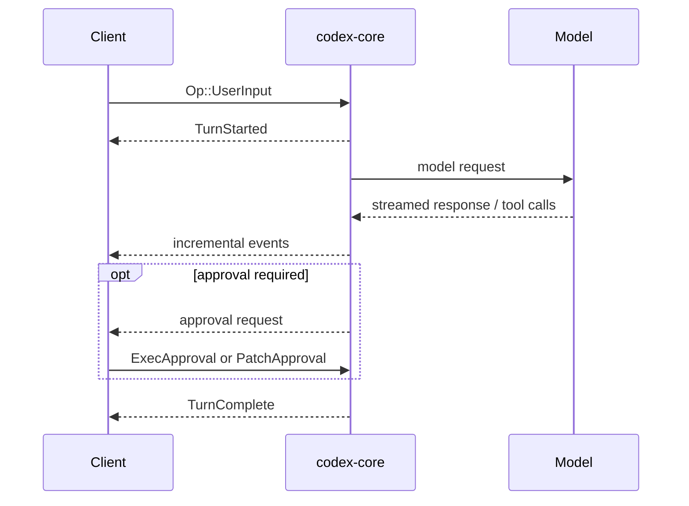

# Codex core protocol

This document describes the in-process protocol between a Codex client and
`codex-core`. It is a Rust API, not a stable JSON-RPC interface. Process-based
clients should use the [app-server protocol](app_server.md) instead.

## Overview

A client starts a configured thread with `ThreadManager::start_thread`. The
returned `NewThread` holds the thread ID, the initial `SessionConfiguredEvent`,
and a `CodexThread` handle that provides two queues:

- the submission queue (SQ): `CodexThread::submit` sends an `Op` and returns
  the generated submission ID (`submit_with_id` takes a caller-built
  `Submission`); and
- the event queue (EQ): `CodexThread::next_event` receives the next `Event`
  containing an `EventMsg`.

Each submission has an ID. Events produced by that submission carry the same
ID so clients can associate asynchronous results with their request.

```text
Client -- Submission { id, op } --> codex-core
Client <-- Event { id, msg } ----- codex-core
```

The current Rust definitions are authoritative:

- [`Op` and `EventMsg`](../protocol/src/protocol.rs)
- [`UserInput`](../protocol/src/user_input.rs)
- [`ThreadManager` and `NewThread`](../core/src/thread_manager.rs)
- [`CodexThread`](../core/src/codex_thread.rs)

## Starting and configuring a thread

`ThreadManager::start_thread` receives the initial `Config`, creates the
thread, and returns its ID with the `CodexThread` handle. There is no separate
session configuration operation.

Configuration that should persist for later turns can be changed with
`Op::ThreadSettings`. A `ThreadSettings` submission updates settings without
starting a turn.

## Starting a turn

Submit `Op::UserInput` to start a turn. It contains:

- `items`: one or more `UserInput` values;
- an optional JSON output schema;
- optional per-turn metadata and additional context; and
- optional thread settings to apply before the turn starts.

`UserInput` supports text, remote images, local images, local paths, skills,
and mentions. See the Rust enum for the exact fields of each variant.

On the serialized event stream, `EventMsg::TurnStarted` uses the event name
`task_started`, and `EventMsg::TurnComplete` uses `task_complete`. The legacy
names `turn_started` and `turn_complete` are accepted as aliases when
deserializing.

`TurnStartedEvent` includes the turn ID and may include trace, start-time,
model context-window, and collaboration-mode information. `TurnCompleteEvent`
includes the turn ID plus completion output, error, surfaced-result, and
timing fields as applicable. It does not contain a response bookmark.

## Common operations

The `Op` enum is non-exhaustive for downstream crates. Important operations currently include:

- `UserInput` to start a turn;
- `ThreadSettings` to update persistent settings;
- `Interrupt` to abort the active turn;
- `ExecApproval` and `PatchApproval` to answer approval requests;
- `ResolveElicitation`, `UserInputAnswer`, and
  `RequestPermissionsResponse` to answer interactive requests;
- `Compact` to compact conversation history;
- `Review` to start an in-process code review (the exec/app-server client does
  not expose this operation); and
- `Shutdown` to stop the thread.

Consult the `Op` definition before depending on the complete variant list.

## Event flow

During a turn, core emits incremental events such as model output, tool
activity, approvals, and item lifecycle updates. A typical flow is:



An interrupted turn ends with `EventMsg::TurnAborted`. A normally completed
turn ends with `EventMsg::TurnComplete`.

## Compatibility boundary

Because this protocol is an internal Rust API, adding enum variants or fields
does not imply a versioned external wire contract. Clients that communicate
with Codex over stdio or another process boundary should use `codex
app-server`; see the [app-server protocol guide](app_server.md) and its links to
the generated request and notification contracts.
